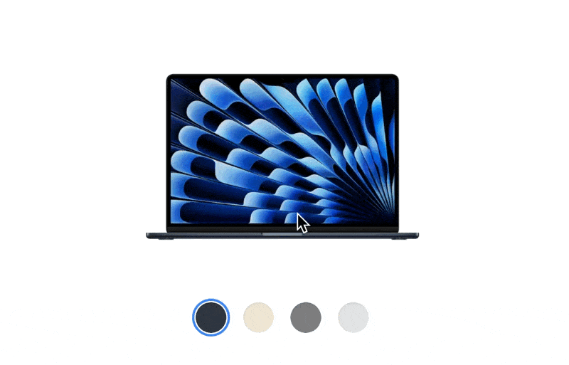
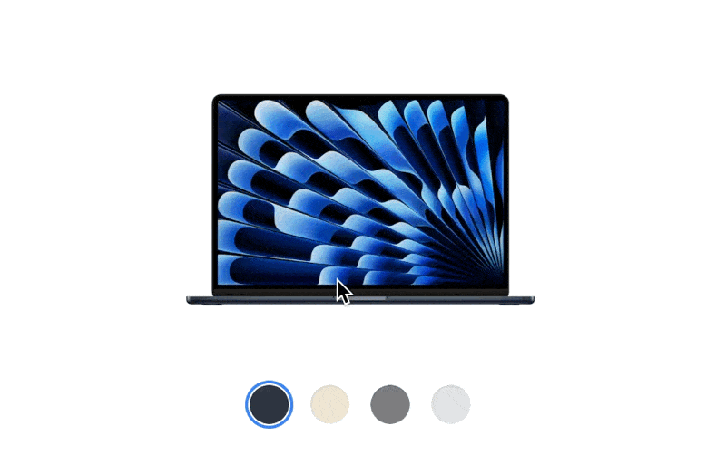

## View Transitions API
[View Transitions API](https://developer.mozilla.org/en-US/docs/Web/API/View_Transitions_API) 예제 레포지토리입니다. Next.js App router 환경에서 구현하였습니다.\
View Transitions API를 활용하면 애니메이션 트랜지션을 쉽게 만들 수 있습니다.

## 라우팅 구성
- `/traditional`: 전통적인 방법으로 트랜지션을 구현한 예제 페이지입니다.\
View Transitions API를 사용했을 때와 비교하기 위해 구현했습니다.
- `/basic`: View Transitions API를 사용한 예제 페이지입니다.
- `/custom`: View Transitions API를 커스텀해서 상황에 맞게 애니메이션을 구현한 예제 페이지입니다.

## 구현 방법
`document.startViewTransition(callback)`를 호출하면서 업데이트 하고자 하는 DOM을 `callback`으로 넘겨주면 자연스러운 트랜지션 효과가 나타납니다.

```tsx
import { useState } from 'react';
import { Product, items } from '@common/product';
import OptionList from '@components/OptionList';
import Thumbnail from '@components/Thumbnail';

function BasicPage() {
  const [item, setItem] = useState(items[0]);

  const handleClick = (item: Product) => {
    updateView(() => setItem(item))
  }

  const updateView = (callback: () => void) => {
    // startViewTransition이 지원되는 브라우저 인지 확인
    if (!document.startViewTransition) {
      callback()
      return
    }

    // 업데이트하고자 하는 DOM을 callback으로 넘겨줌
    document.startViewTransition(callback)
  }

  return (
    <div>
      <Thumbnail item={item} />
      <OptionList
        items={items}
        selectedItem={item}
        onClick={handleClick}
      />
    </div>
  )
}
```

단 `startViewTransition()` 코드를 그냥 작성하면 에러가 발생하기 때문에 코드에서 인식할 수 있게 다음과 같이 `index.d.ts`에 커스텀으로 타입을 추가해주었습니다.

```tsx
export { };

declare global {
  interface Document {
    startViewTransition(callback: () => void): {
      ready: Promise<void>,
      updateCallbackDone: Promise<void>,
      finished: Promise<void>
    }
  }
}
```

## 구현 화면

### 기본



### 응용

